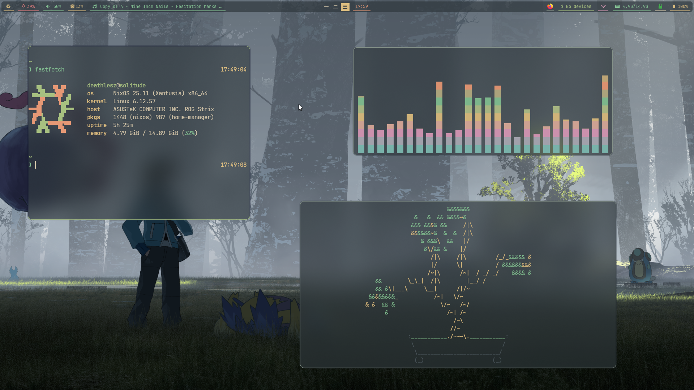
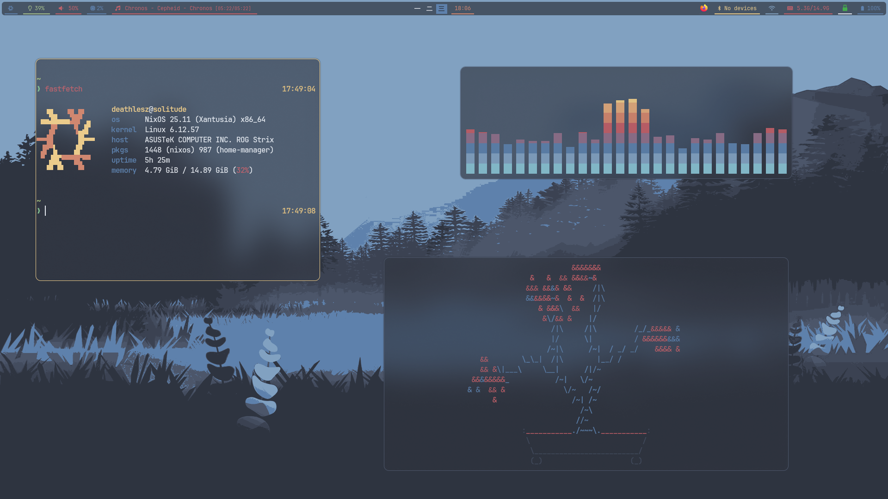

# My NixOS Configuration

This is my personal NixOS configuration :). I tried to make it as customizable as possible through
module system.

## Gallery

Some screenshots:

| Everforest Medium | Nord |
| :---: | :---: |
|  |  |

## Installation

1. Clone this repository:
    ```bash
    export DOTFILES_PATH="$HOME/dotfiles"
    git clone https://github.com/deathlesz/nixos $DOTFILES_PATH
    cd $DOTFILES_PATH
    ```
1. Create a directory for your host from a template:
    ```bash
    export HOSTNAME=$(hostname) # or change it to something else
    cp -r ./hosts/__TEMPLATE ./hosts/${HOSTNAME}
    ```
1. Copy your `hardware-configuration.nix` there:
    ```bash
    cp /etc/nixos/hardware-configuration.nix ./hosts/${HOSTNAME}/
    ```
    If you're installing NixOS from scratch, you may need to generate it. See [NixOS Manual](https://nixos.org/manual/nixos/stable/#sec-installation-manual-installing)
    for how to do that.
1. Now you may then customize it as you want. The documentation is inline with the configuration itself.
1. When done, apply the configuration:
    ```bash
    sudo nixos-rebuild switch --flake ${DOTFILES_PATH}#${HOSTNAME}
    ```
    Alternatively, if you're installing NixOS:
    ```bash
    sudo nixos-install --flake ${DOTFILES_PATH}#{HOSTNAME}
    ```

## License

This is free and unencumbered software released into the public domain.

Anyone is free to copy, modify, publish, use, compile, sell, or
distribute this software, either in source code form or as a compiled
binary, for any purpose, commercial or non-commercial, and by any
means.

For more details, please see the [UNLICENSE](UNLICENSE) file or [unlicense.org](https://unlicense.org/).
